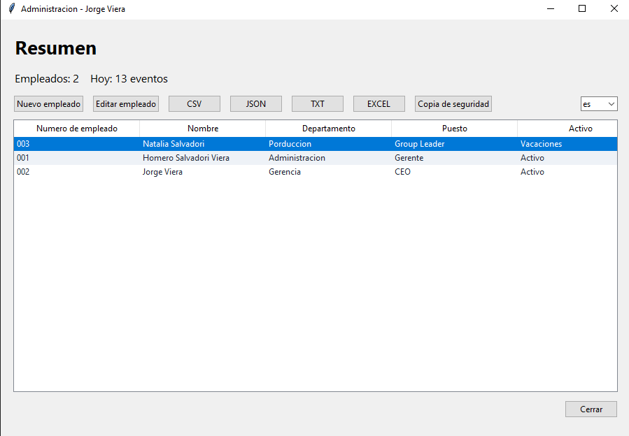
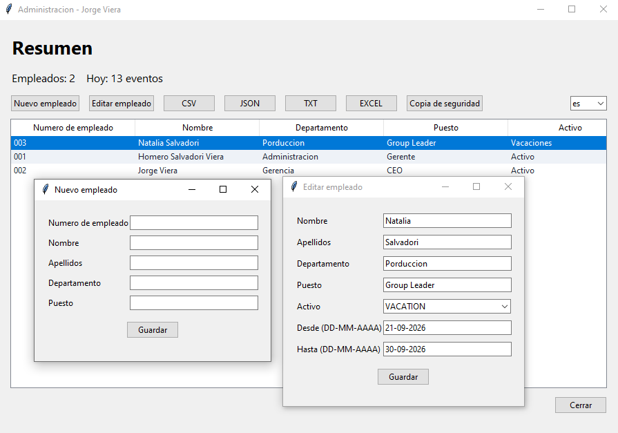
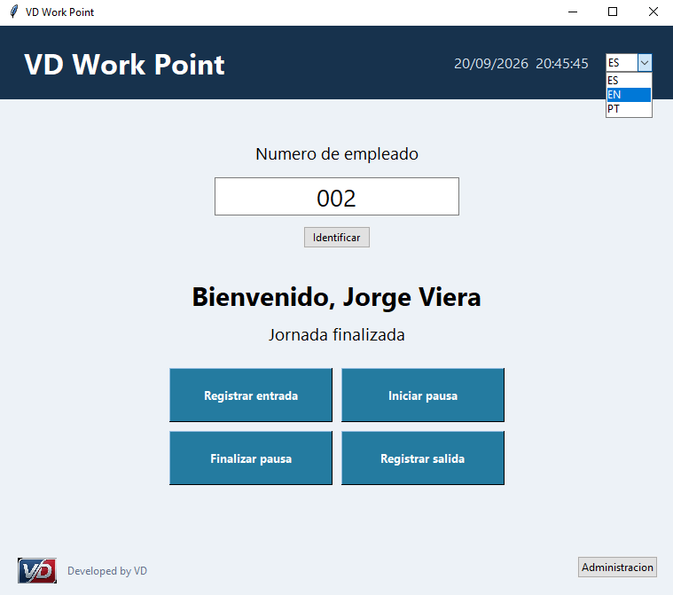

# VD Work Point

## Sistema local de control horario para pequenas y medianas empresas

VD Work Point es una aplicacion de escritorio orientada a simplificar el registro y la consulta de la jornada laboral en entornos que necesitan una solucion local, clara y mantenible.

Este repositorio es una presentacion publica del proyecto. El codigo fuente, la aplicacion compilada y los datos de uso no forman parte de este repositorio.

## Propuesta de valor

- Registro de entradas, salidas y pausas desde una interfaz sencilla.
- Panel administrativo para gestionar empleados y consultar historiales.
- Correcciones controladas con motivo y trazabilidad.
- Exportacion de informacion en formatos habituales para la gestion interna.
- Funcionamiento local, sin depender de un servicio web externo.
- Soporte de varios idiomas para facilitar su adopcion.

## Funcionalidades destacadas

### Registro de jornada

La aplicacion permite identificar al empleado y registrar cada momento relevante de su jornada, validando la secuencia de fichajes para evitar inconsistencias.

### Administracion

El area administrativa permite consultar empleados, revisar historiales, gestionar estados laborales y realizar correcciones justificadas.

### Informes y respaldo

La informacion puede prepararse para su consulta y exportacion, y la base de datos local puede respaldarse para facilitar la continuidad operativa.

## Tecnologias

- Python
- Tkinter
- SQLite
- openpyxl
- Pillow
- PyInstaller

## Capturas de pantalla

Las siguientes capturas muestran el flujo general y la interfaz de la aplicacion:

## Enfoque del proyecto

VD Work Point fue concebido como una herramienta de escritorio practica para organizaciones que prefieren mantener sus datos localmente y disponer de un flujo de trabajo directo, sin la complejidad de una infraestructura web.

El proyecto pone el foco en la claridad de uso, la trazabilidad de las operaciones administrativas y la posibilidad de adaptar la solucion a las necesidades de cada empresa.

## Estado

Proyecto desarrollado como solucion funcional de escritorio y presentado aqui como parte de un portfolio profesional.

El acceso al codigo fuente y a las versiones ejecutables se mantiene de forma privada.

## Contacto

Para conocer mas sobre el proyecto, solicitar una demostracion o consultar una posible adaptacion, contacta con el autor a traves de su perfil de GitHub.
